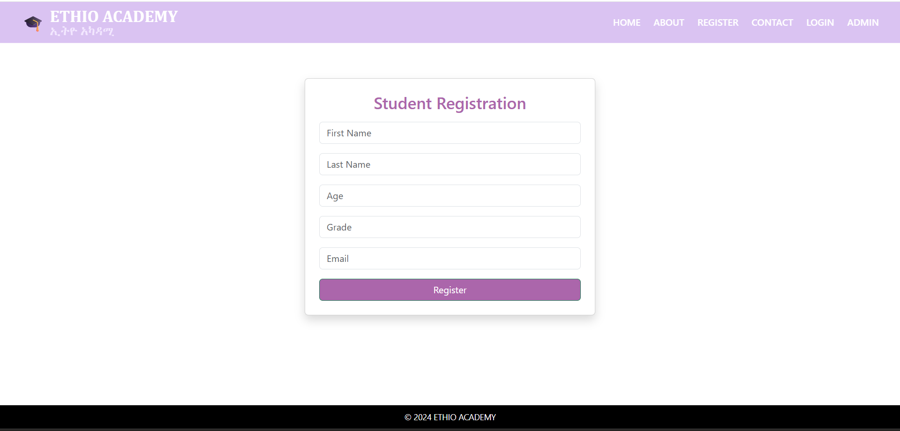

# Ethio Academy Enrollment System

This is a web-based enrollment system developed as part of my Computer Science studies at the University of Gondar.

## Features
* Student Registration and Login
* Management Dashboard
* Secure configuration using Environment Variables

## Technologies Used
* **Backend:** Django (Python)
* **Frontend:** HTML5, CSS
* **Database:** SQLite
* **Security:** Python-dotenv for Secret Key protection
* ## System Preview

### Registration Page
*This is where new students create their Ethio Academy accounts.*

### Home page 
*After logging in, students can view their enrollment status here.*

